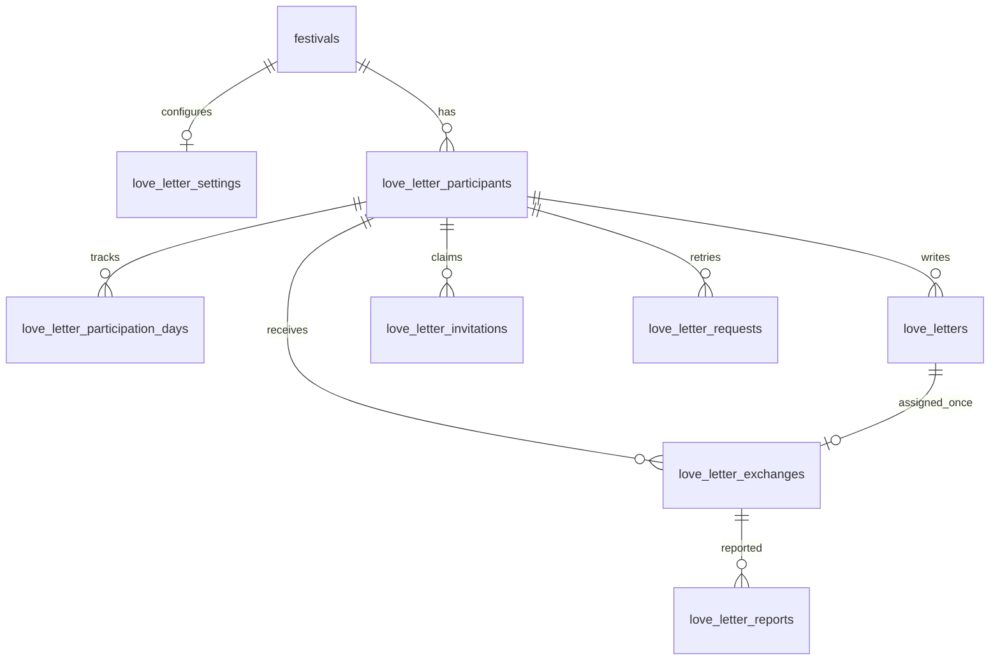

# 러브레터 데이터·API·운영 설계

[위키 홈](../README.md) · 읽는 때: LOVE-001 API·DB·보안·운영 구현

[제품 명세](../product/love-letter.md)가 화면 동작의 기준이다. 이 문서는 공개 카탈로그와
분리된 운영 개인정보 저장·계약의 경계를 정의한다.

관리자 설정의 시작 시각은 첫 행사일 09:00 KST, 종료 시각은 마지막 행사일 다음 날
00:00 KST여야 한다. 서버는 각 행사일 09:00~24:00에만 참여·열람을 허용한다.
자정부터 09:00까지 상태는 `BEFORE_OPEN`이며 다음 09:00을 안내한다.

## 저장과 원자성

익명 참여자, 날짜별 참여, 쪽지, 배정, 신고, 일회용 사전 연결 링크를 별도 테이블로 둔다.

참여자 토큰과 초대 링크는 256비트 이상 난수이고 DB에는 SHA-256만 저장한다.
쪽지의 이름·내용·연락처는 각각 AES-256-GCM으로 암호화하고 key version과 nonce를
함께 저장한다. 암호화 키는 서버 비밀 설정에서 읽고 catalog·DB·코드·로그에 넣지 않는다.

`(participant_id, operating_date)`와 배정된 `letter_id`는 DB 유일
제약으로 보호한다. 등록 transaction은 축제별 잠금 아래 다른 성별·미배정·미차단·타인
쪽지를 무작위 선정하고, 암호화 쪽지·당일 기록·배정·`COMPLETED` 전환을 함께 저장한다.
후보가 없으면 아무 기록도 만들지 않고 409를 반환한다. 배정 시각부터 60초 전에는 상태
응답에서 결과 ID·연락처를 숨기고 개봉을 거절한다. 사전 등록자는 지정일에 링크를
연결하면서 배정을 시도한다. 후보가 없으면 `SEEDED` 기록을 보존하고 서버가 주기적으로
재시도한다. 사전 등록자도 배정 시각부터 60초를 기다린다. Idempotency-Key는 참여자와
요청 hash에 묶어 등록 쪽지 ID·열람 시각을 복구한다. 연락처 원문은 재시도 기록에 저장하지 않는다.

## 공개 API v2

| 경로 | 의미 |
|---|---|
| `GET /api/v2/love-letter-guide` | 비활성/운영 상태·기간·동의문 버전·안내 |
| `POST /api/v2/love-letter-participants` | 전용 익명 쿠키 발급 |
| `GET /api/v2/love-letter-status` | 60초 열람 대기·봉투 상태·최근 연락처 |
| `POST /api/v2/love-letters` | 쪽지 등록과 원자적 배정, `revealAt` 반환. 결과 ID는 숨김 |
| `POST /api/v2/love-letter-results/{id}/open` | 배정 60초 후 해당 브라우저에게만 봉투 원문 공개 |
| `POST /api/v2/love-letter-results/{id}/reports` | 현재 받은 쪽지 신고 |
| `POST /api/v2/love-letter-invitations/claim` | 일회용 사전 링크 연결 |

관리자 전용 경로는 `/api/v2/admin/love-letters` 아래 사전 등록·링크 재발급,
신고 목록·상세, 쪽지 차단, 참여자 제한·해제, 기능 운영 중지를 둔다. 응답은 기존
API v2 envelope·오류 형식을 따르고 개인정보 응답은 `Cache-Control: no-store`다.
차단 상태에서 추가 열람은 거절한다. 새 기능은 기존 v2 필드를 변경하지 않는다.

## 보안과 보관

전용 `__Host-` 쿠키는 HttpOnly·Secure·SameSite=Lax로 발급한다. 모든 쿠키 기반 쓰기
요청에 Origin 검증과 CSRF 방어를 적용한다. 등록·개봉·신고·링크 연결에 요청 수 제한을
두고 자유 텍스트를 로그·분석·오류 메시지에 남기지 않는다. 운영자 열람·차단·제한은
ADMIN 인증 후 대상 ID와 조치만 감사한다. 초대 링크 원문은 발급 응답에서 한 번만
전달하고 request 로그·referrer에 나타나지 않게 URL fragment로 운반한다.

행사 종료 후 공개 열람을 닫고 7일 뒤 기존 cleanup 배치에서 쪽지·배정·
신고·초대·참여 기록을 삭제한다. 기능 정지와 DB 삭제는 분리한다. 백업 복구 시 종료
기한이 지난 개인정보의 재삭제 절차는 [운영·연동 인계](../workflow/love-letter-operations.md)에 명시한다. 암호화 키 미설정, 운영
기간 미설정 또는 양쪽 사전 쪽지 부족 시 기능은 비활성 상태로 유지한다.
